# Microsoft 365 Enterprise Administration & Security Lab

## Overview

This project demonstrates the design, administration, security, endpoint management, monitoring, automation, and troubleshooting of a **cloud-only Microsoft 365 Business Premium environment**.

The lab was designed to simulate practical responsibilities across:

- IT Support
- Microsoft 365 Administration
- Endpoint Administration
- Identity and Access Management
- Cybersecurity Operations

The environment integrates:

- Microsoft Entra ID
- Microsoft Intune
- Conditional Access
- Microsoft Defender for Business
- Exchange Online
- OneDrive
- SharePoint Online
- Microsoft Graph PowerShell
- Windows 11 Enterprise

The project follows the complete lifecycle of a cloud-managed enterprise endpoint, from identity creation and authentication through device management, security monitoring, detection, investigation, automation, and IT support.

---

## Architecture

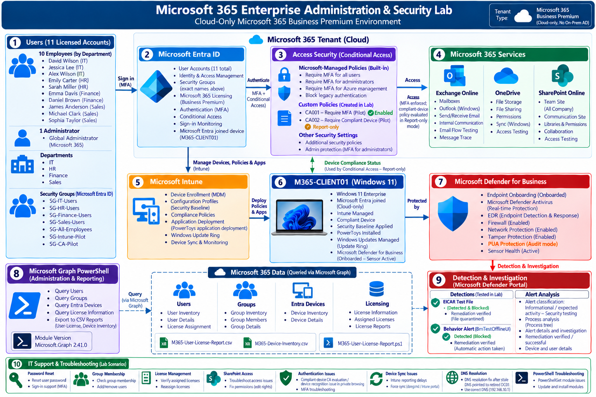

The lab uses a cloud-native Microsoft 365 architecture centered around a Microsoft Entra joined and Intune-managed Windows 11 endpoint.

### Core Components

- **Microsoft Entra ID** — Identity and access management
- **Microsoft Intune** — Endpoint enrollment, configuration, compliance, applications, and updates
- **Conditional Access** — MFA and device-based access evaluation
- **Microsoft Defender for Business** — Endpoint protection, EDR, firewall, alerting, and investigation
- **Exchange Online** — Cloud email services
- **OneDrive** — User cloud storage and file sharing
- **SharePoint Online** — Corporate collaboration and permission management
- **Microsoft Graph PowerShell** — Tenant inventory, reporting, and automation
- **M365-CLIENT01** — Windows 11 Enterprise managed endpoint

### Security Lifecycle

**Identity → Authentication → Enrollment → Configuration → Compliance → Conditional Access → Endpoint Protection → Detection → Investigation → Automation → Support**

---

## Lab Environment

| Component | Implementation |
|---|---|
| Microsoft 365 | Business Premium |
| Architecture | Cloud-only |
| Identity | Microsoft Entra ID |
| Endpoint Management | Microsoft Intune |
| Endpoint | Windows 11 Enterprise |
| Endpoint Security | Microsoft Defender for Business |
| MFA | Microsoft Authenticator |
| Access Control | Conditional Access |
| Email | Exchange Online |
| Cloud Storage | OneDrive |
| Collaboration | SharePoint Online |
| Automation | Microsoft Graph PowerShell |

The tenant contains **10 fictional employee accounts and one administrative account**, for a total of **11 licensed accounts**.

The fictional employees were organized across:

- IT
- HR
- Finance
- Sales

---

## Identity and Access Management

Microsoft Entra ID was used as the central identity platform for the environment.

### Security Groups

Department and pilot security groups included:

- `SG-IT-Users`
- `SG-HR-Users`
- `SG-Finance-Users`
- `SG-Sales-Users`
- `SG-All-Employees`
- `SG-Intune-Pilot`
- `SG-CA-Pilot`

These groups were used for department-based access, Intune targeting, Conditional Access testing, SharePoint permissions, and pilot security deployments.

### Multi-Factor Authentication

Microsoft Authenticator was configured and tested for MFA. Authentication testing validated successful MFA prompts and sign-ins for pilot users.

### Conditional Access

Conditional Access was implemented and tested using pilot groups.

#### `CA001-Require-MFA-Pilot`

- Targeted pilot users
- Required MFA
- Enabled
- Sign-in behavior validated through Microsoft Entra logs

#### `CA002-Require-Compliant-Device-Pilot`

- Targeted the Intune pilot group
- Required the device to be marked compliant
- Configured in **Report-only** mode
- Used to evaluate compliant-device behavior without enforcing a production-style block

A private browsing session initially did not provide the expected managed-device identity during compliant-device evaluation. The test was repeated using a normal Microsoft Edge session on the Microsoft Entra joined endpoint, where the device context was correctly evaluated.

Microsoft-managed Conditional Access policies were also present in the tenant, including controls related to MFA for users, MFA for administrators, Azure management access, and legacy authentication blocking. These were kept separate from the custom pilot policies.

---

## Microsoft 365 Administration

### Exchange Online

Exchange Online administration included:

- Mailbox validation
- Outlook access
- Internal email testing
- Email delivery verification
- Exchange Message Trace

A test email was successfully sent between lab users and confirmed as delivered through Message Trace.

### OneDrive

OneDrive testing included:

- User authentication
- Document creation
- File upload
- User-specific sharing
- View-only permissions
- Access validation

A test document was shared between lab users and successfully validated using the intended access permissions.

### SharePoint Online

A SharePoint communication site was configured as:

**Cyberhost Corporate Portal**

The site was used to test group-based authorization.

Permission model:

- `SG-All-Employees` → Read
- `SG-IT-Users` → Edit
- Administrator → Full Control

Permissions were validated using users from different departments.

---

## Microsoft Intune Endpoint Management

The Windows endpoint `M365-CLIENT01` was successfully:

- Microsoft Entra joined
- Enrolled in Microsoft Intune
- Assigned corporate ownership
- Assigned a primary user
- Synchronized with Intune
- Evaluated for compliance

The endpoint became the primary managed device used throughout the project.

### Intune Configuration Baseline

A pilot Windows configuration profile was created:

`WIN-Baseline-Pilot`

Implemented controls included:

- Maximum inactivity device lock
- Microsoft Defender SmartScreen
- Prevention of SmartScreen warning override
- Windows experience restrictions
- Password-related configuration dependencies

The final Intune report showed successful deployment of six configuration components.

### Device Compliance

A Windows compliance policy was created:

`WIN-Compliance-Pilot`

The compliance policy evaluated:

- Antivirus
- Antispyware
- Windows Firewall
- TPM / device health

`M365-CLIENT01` successfully reached a **Compliant** state.

The compliant-device state was then used during Conditional Access evaluation.

---

## Application and Update Management

### Application Deployment

Microsoft PowerToys was deployed as a required application through Microsoft Intune.

The application was successfully installed and validated directly on `M365-CLIENT01`.

Portal reporting did not immediately reflect the installation, demonstrating a realistic Intune reporting delay. Endpoint-side validation was therefore used to confirm successful deployment.

### Windows Update Management

A Windows Update ring was created:

`WIN-UpdateRing-Pilot`

The configuration demonstrated centralized update management for the Windows endpoint, including quality updates, feature updates, and managed update behavior.

---

## Microsoft Defender for Business

`M365-CLIENT01` was onboarded into Microsoft Defender for Business.

Successful onboarding was validated through:

- Defender device inventory
- Onboarding status: **Onboarded**
- Sensor health: **Active**
- Microsoft Defender `Sense` service running

### Microsoft Defender Antivirus

A dedicated Microsoft Defender Antivirus policy was created:

`DEF-AV-Pilot`

Endpoint-side validation confirmed:

- Real-time protection enabled
- Behavior monitoring enabled
- Downloaded-file scanning enabled
- Script scanning enabled
- Network Protection enabled
- PUA Protection configured in **Audit mode**

PowerShell was used to validate the actual endpoint security state rather than relying exclusively on portal reporting.

### Microsoft Defender Firewall

A Microsoft Defender Firewall policy was deployed for:

- Domain profile
- Private profile
- Public profile

PowerShell verification confirmed that all three Windows Firewall profiles were enabled.

### Tamper Protection

Microsoft Defender Tamper Protection was validated directly on the endpoint.

Example validation:

```powershell
Get-MpComputerStatus |
Select-Object IsTamperProtected,RealTimeProtectionEnabled
```

Result:

```text
IsTamperProtected           True
RealTimeProtectionEnabled   True
```

---

## Security Detection and Investigation

Two security validation scenarios were performed to test both traditional malware prevention and behavioral detection.

### EICAR Malware Detection

The safe EICAR antivirus test file was used to validate Microsoft Defender malware detection.

Microsoft Defender successfully:

- Detected the EICAR test file
- Classified it as malware
- Prevented the threat
- Generated an alert
- Associated the detection with `M365-CLIENT01`
- Identified the affected user
- Recorded the file path
- Recorded the file hash
- Exposed process execution evidence
- Supported investigation through the Defender portal

The test file was subsequently quarantined.

### Behavioral / EDR Detection

A Microsoft Defender behavior-monitoring test was performed using PowerShell.

Defender generated the behavioral detection:

`Behavior:Win32/BmTestOfflineUI`

The investigation showed:

- Suspicious PowerShell activity
- Behavior-monitoring detection
- Process execution evidence
- Defender intervention
- Successful remediation

The resulting alert was reviewed and resolved as:

**Informational / expected activity — Security testing**

This demonstrated the difference between signature-based malware detection and behavior-based endpoint detection.

---

## Microsoft Graph PowerShell

Microsoft Graph PowerShell SDK was installed on the administration workstation.

The environment initially contained an outdated PowerShellGet version, which prevented the installation process from working correctly. PowerShellGet and the NuGet provider were updated before successfully installing Microsoft Graph PowerShell.

The installed Graph SDK version used during the lab was:

`2.41.0`

Authentication was performed using delegated permissions and device-code authentication.

### Microsoft Graph Administration

Graph PowerShell was used to query:

- Users
- Security groups
- Microsoft Entra devices
- Microsoft 365 licensing

Example commands:

```powershell
Get-MgUser
Get-MgGroup
Get-MgDevice
Get-MgSubscribedSku
```

The device query successfully identified `M365-CLIENT01` as a Microsoft Entra joined Windows device.

The tenant licensing query confirmed 11 consumed Business Premium licenses.

---

## PowerShell Automation

A reusable PowerShell script was created to generate a Microsoft 365 user-license report.

### Script

`scripts/M365-User-License-Report.ps1`

The script retrieves:

- Display name
- User principal name
- Account status
- License status
- License count

### Reports

Generated reports include:

- `reports/M365-User-License-Report.csv`
- `reports/M365-Device-Inventory.csv`

These artifacts demonstrate practical Microsoft 365 reporting and tenant inventory automation.

---

## IT Support Scenarios

The lab also included practical Microsoft 365 help-desk and support workflows.

Scenarios included:

- Password reset
- Temporary password issuance
- Forced password change
- Blocking user sign-in
- Restoring user access
- Security group membership changes
- Microsoft 365 license removal
- Microsoft 365 license reassignment
- SharePoint permission troubleshooting
- Authentication/session troubleshooting

### SharePoint Access Troubleshooting

A simulated support scenario involved a user reporting inability to edit the corporate SharePoint portal.

The troubleshooting process included:

1. Checking user group membership
2. Reviewing SharePoint permissions
3. Confirming the correct Edit permission
4. Testing using a fresh authenticated browser session
5. Verifying that access worked successfully

The scenario demonstrated how stale authentication/session state can affect recently changed permissions.

---

## Troubleshooting and Lessons Learned

### DNS Resolution Failure

The Windows endpoint retained a stale DNS configuration pointing to the retired domain controller:

`192.168.100.10`

Symptoms:

- External IP connectivity worked
- `ping 8.8.8.8` succeeded
- DNS queries timed out
- Microsoft cloud services could not resolve

Resolution:

```powershell
Set-DnsClientServerAddress `
-InterfaceAlias "Ethernet 2" `
-ResetServerAddresses

ipconfig /flushdns
```

DNS resolution was restored and Microsoft cloud connectivity resumed.

### Intune Reporting Delays

Several Intune configurations successfully applied to the endpoint before the management portal updated.

Examples included application installation, configuration reporting, and device state updates.

Endpoint-side validation was therefore used alongside Intune cloud reporting.

### Conditional Access Device Recognition

A compliant-device Conditional Access evaluation initially failed during private browsing because the session did not provide the expected managed-device context.

The test was repeated using a standard Microsoft Edge session on the Entra-joined endpoint, where the device identity and compliance context were successfully evaluated.

### Microsoft Graph Installation

The administration workstation originally contained `PowerShellGet 1.0.0.1`.

PowerShellGet and the package-management components were upgraded before Microsoft Graph SDK installation, providing practical troubleshooting experience with PowerShell module management.

---

## Lab Evidence

The following screenshots provide selected evidence from the implementation, validation, administration, and security-investigation phases.

### Microsoft Defender for Business

#### EICAR Malware Investigation

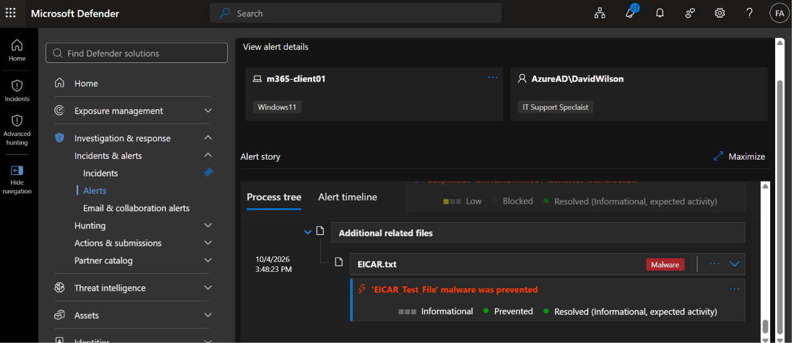

Microsoft Defender detected and prevented the safe EICAR test file and generated investigation evidence linking the file, user, endpoint, and process activity.

#### Behavioral / EDR Investigation

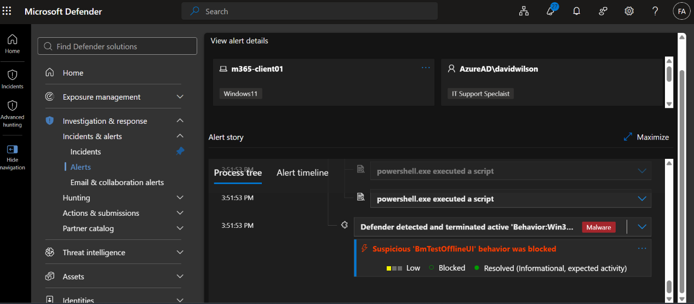

The behavioral security test generated a Defender alert with process and remediation evidence.

#### Defender Device Inventory

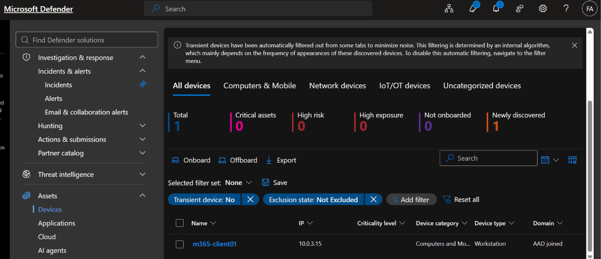

The Defender device inventory confirms that the endpoint is represented in Microsoft Defender for Business.

#### Defender Onboarding and Sensor Health

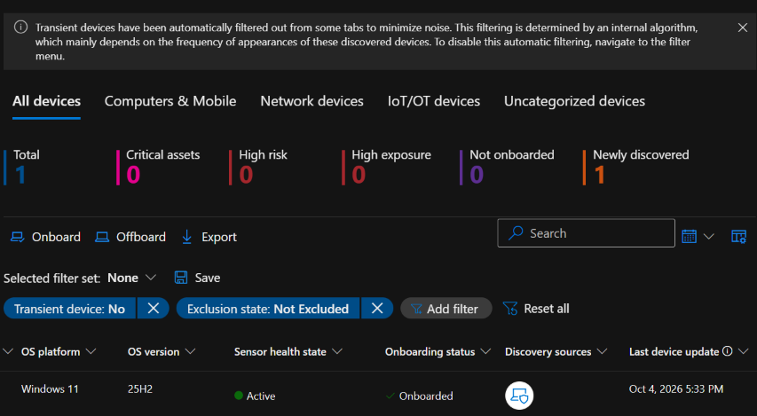

This evidence confirms:

- Sensor health: **Active**
- Onboarding status: **Onboarded**
- Windows 11 endpoint

#### Defender / Intune Integration View

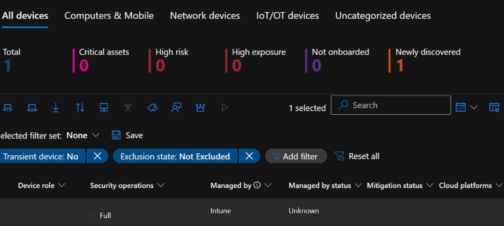

This Defender view shows the device being managed by Microsoft Intune and operating with full security operations integration.

---

### Microsoft Intune Evidence

#### Compliant Managed Device

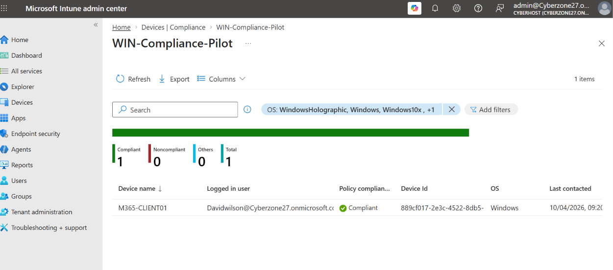

`M365-CLIENT01` is shown as compliant under `WIN-Compliance-Pilot`.

#### Per-Setting Compliance

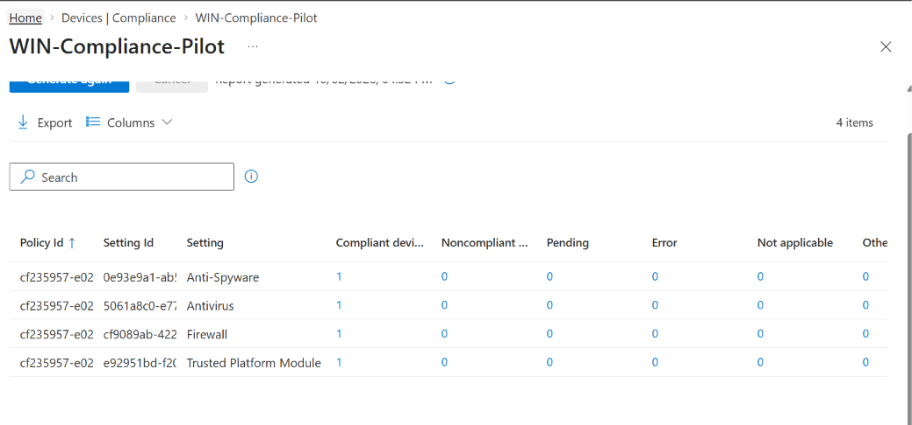

The compliance report confirms successful evaluation of:

- Anti-Spyware
- Antivirus
- Firewall
- Trusted Platform Module

with no noncompliant, pending, or error results.

#### Security Baseline

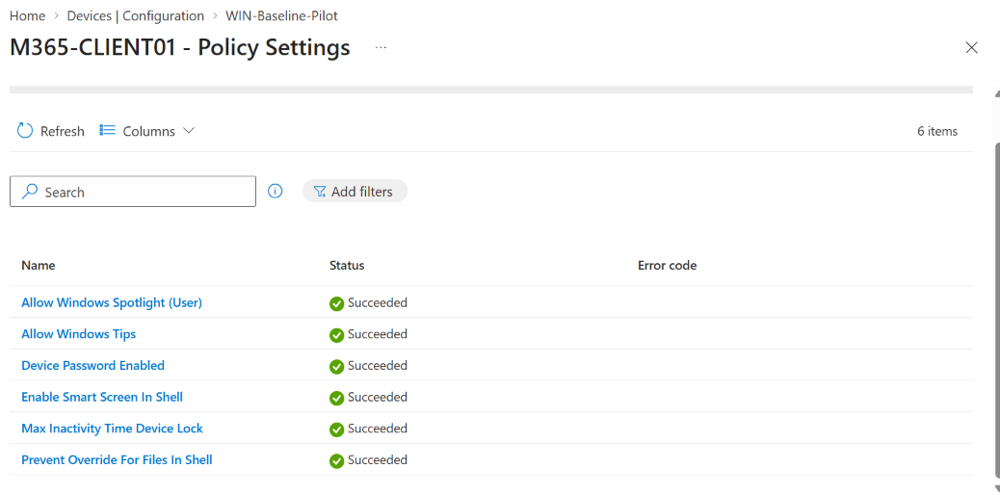

`WIN-Baseline-Pilot` successfully deployed six configuration components to `M365-CLIENT01`.

---

### Conditional Access Evidence

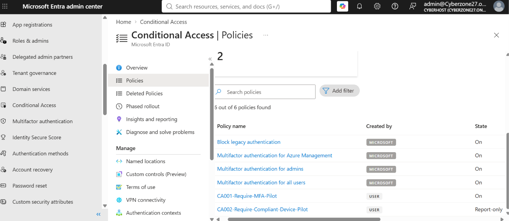

The Conditional Access policy list clearly distinguishes:

- Microsoft-managed policies
- `CA001-Require-MFA-Pilot` — **On**
- `CA002-Require-Compliant-Device-Pilot` — **Report-only**

---

### Microsoft Graph PowerShell Evidence

#### License Inventory

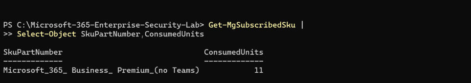

Microsoft Graph PowerShell was used to inspect Business Premium license consumption.

#### Group and Device Inventory

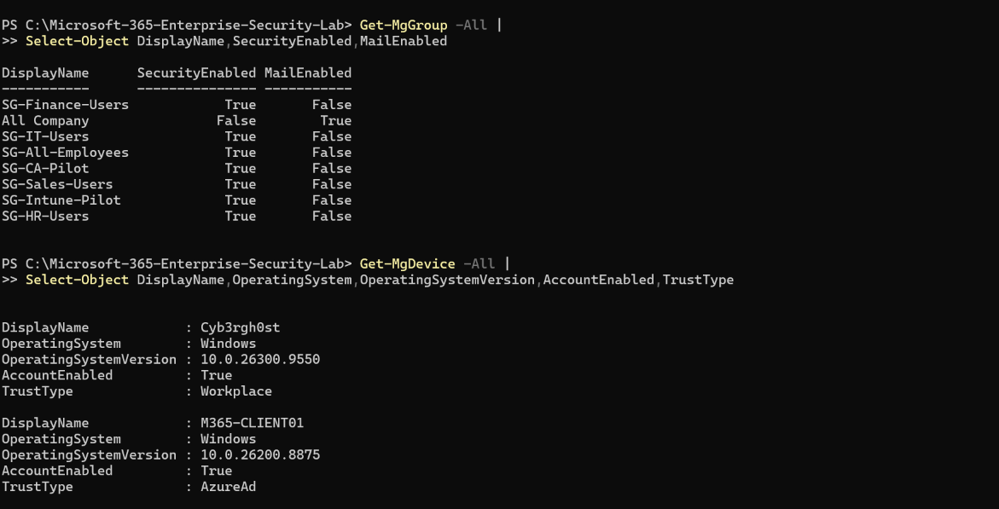

Microsoft Graph PowerShell was used to enumerate tenant security groups and Microsoft Entra device inventory, including `M365-CLIENT01`.

---

### Additional Evidence

Additional implementation, administration, support, and troubleshooting screenshots are stored under:

`screenshots/misc/`

The miscellaneous evidence includes supporting screenshots for:

- Microsoft Entra join
- Endpoint enrollment
- Application deployment
- Defender validation
- Microsoft Graph reporting
- Password administration
- Sign-in blocking and restoration
- Group membership administration
- Microsoft 365 licensing workflows
- Other IT support activities

---

## Repository Structure

```text
Microsoft-365-Enterprise-Security-Lab/
│
├── README.md
│
├── diagrams/
│   └── m365-security-lab-architecture.png
│
├── screenshots/
│   ├── 01-defender-eicar-investigation(1).png
│   ├── 02-defender-behavior-investigation.png
│   ├── 03-defender-device-onboarded(1).png
│   ├── 04-defender-device-onboarded(1).png
│   ├── 05-intune-managed-device(1).png
│   ├── 06-intune-compliance-policy(1).png
│   ├── 07-intune-compliance-policy(1).png
│   ├── 08-intune-security-baseline.png
│   ├── 09-conditional-access-policies.png
│   ├── 10b-graph-license-inventory.png
│   ├── 10c-groups.png
│   └── misc/
│       ├── 01.png
│       ├── 02.png
│       ├── ...
│       └── 20.png
│
├── scripts/
│   └── M365-User-License-Report.ps1
│
└── reports/
    ├── M365-User-License-Report.csv
    └── M365-Device-Inventory.csv
```

---

## Key Skills Demonstrated

- Microsoft 365 Administration
- Microsoft Entra ID
- Identity and Access Management
- Microsoft Intune
- Endpoint Management
- Conditional Access
- Multi-Factor Authentication
- Microsoft Defender for Business
- Endpoint Detection and Response
- Microsoft Defender Antivirus
- Windows Defender Firewall
- Network Protection
- Tamper Protection
- Endpoint Compliance
- Exchange Online
- SharePoint Online
- OneDrive
- Microsoft Graph
- PowerShell
- Security Monitoring
- Alert Investigation
- Incident Analysis
- IT Support
- Troubleshooting

---

## Key Outcome

This project demonstrates the complete lifecycle of a Microsoft 365 cloud-managed endpoint:

**Identity → Authentication → Enrollment → Configuration → Compliance → Conditional Access → Endpoint Protection → Detection → Investigation → Automation → IT Support**

The lab combines Microsoft 365 administration, endpoint management, identity security, cybersecurity operations, PowerShell automation, and practical IT support workflows in one integrated cloud environment.

The result is a hands-on enterprise lab demonstrating both **IT administration and cybersecurity operations** using technologies commonly encountered in modern Microsoft-based organizations.

